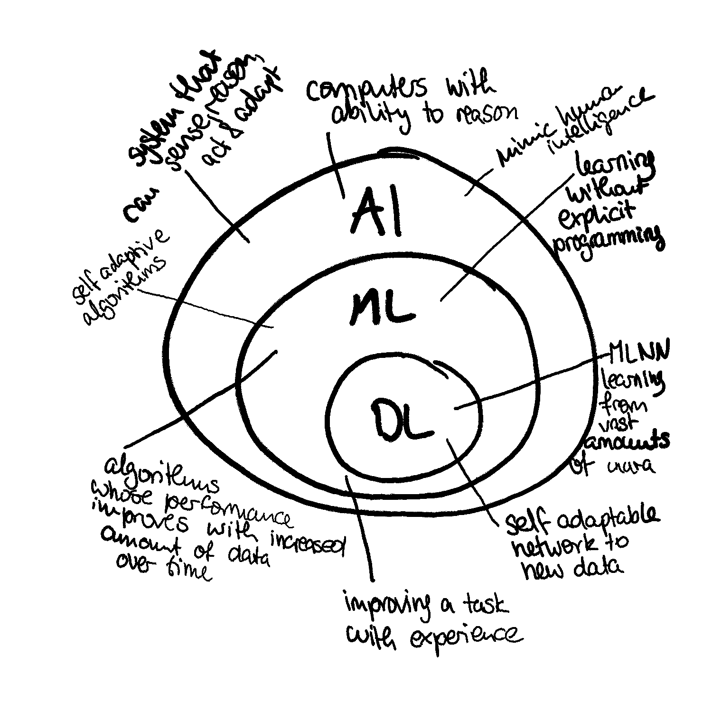
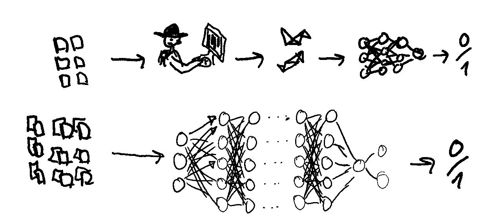

## What is Deep Learning?

### Deep Learning, Machine Learning and Artificial Intelligence

Deep learning is just one of many techniques collectively known as machine learning. Machine learning (ML) refers to techniques where a computer can "learn" patterns in data, usually by being shown numerous examples to train it. People often talk about machine learning being a form of artificial intelligence (AI). Definintions of artificial intelligence vary, but usually involve having computers mimic the behaviour of intelligent biological systems. Since the 1950s many works of science fiction have dealt with the idea of an artificial intelligence which matches (or exceeds) human intelligence in all areas. Although there have been great advances in AI and ML research recently we can only come close to human like intelligence in a few specialist areas and are still a long way from a general purpose AI.

Deep learning is based upon a technique known as an artificial neural network, which uses a simplified model of a collection of neurons in the brain. Each neuron has several inputs and typically one output. The neuron produces its output by combining the values of its inputs in someway. By altering the sensitivites (known as weights) to the different inputs we can alter the neuron's behaviour. A network can be trained by adjusting these weights many times and comparing the output of the network with some example training data.

Artificial neural networks aren't a new technique, they have been around since the late 1940s. But until around 2010 neural networks tended to be quite small, consisting of only 10s or perhaps 100s of neurons. Around 2010 improvements in computing power and the algorithms for training the networks made much larger and more powerful networks practical.

* relation of DL to ML (infographics AI, ML, (NN), DL)

Deep learning requires extensive training using example data which shows the network what output it should produce for a given input. One common application of deep learning is classifying images. Here the network will be trained by being "shown" a series of images and told what they contain. Once the network is trained it should be able to take another image and correctly classify its contents. But we are not restricted to just using images, any kind of data can be learned by a deep learning neural network. This makes them able to appear to learn a set of complex rules only by being shown what the inputs and outputs of those rules are instead of being taught the actual rules. Using these approaches deep learning networks have been taught to play video games and even drive cars. The data on which networks are trained usually has to be quite extensive, typically including thousands of examples. For this reason they are not suited to all applications and should be considered just one of many machine learning techniques which are available.

### What sort of problems can it solve?

* Pattern/object recognition
* Segmenting images (or any data)
* Translating between one set of data and another, for example natural language translation.
* Generating new data that looks similar to the training data, often used to create synthetic datasets, art or even "deepfake" videos.
  * This can also be used to give the illusion of enhancing data, for example making images look sharper, video look smoother or adding colour to black and white images. But beware of this, its not an accurate recreation of the original data, but a recreation based on something statistically similar, effectively a digital imagination of what that data could look like.

### What sort of problems can't it solve?

* Only small amounts of training data
* Tasks requiring an explanation of how the answer was arrived at
* Being asked to classify things which are nothing like their training data.

### What sort of problems can it solve, but shouldn't be used for?

Deep learning needs a lot of computational power, for this reason it often relies on specialist hardware like graphical processing units (GPUs). Many computational problems can be solved using less intensive techniques, but could still technically be solved with deep learning.

The following could technically be achieved using deep learning, but it would probably be a very wasteful way to do it:

* Logic operations, such as computing totals, averages, ranges etc. (see [this example](https://joelgrus.com/2016/05/23/fizz-buzz-in-tensorflow) applying deep learning to solve the "FizzBuzz" problem often used for programming interviews)
* Modelling well defined systems, where the equations governing them are known and understood.
* Basic computer vision tasks such as edge detection, decreasing colour depth or blurring an image.

> ## Deep Learning Problems Exercise
> Which of the following could you apply deep learning to?
> 1. Recognising whether or not a picture contains a bird.
> 2. Calculating the median and interquartile range of a dataset.
> 3. Identifying MRI images of a rare disease when only one or two example images available for training.
> 4. Identifying people in pictures after being trained only on cats and dogs.
> 5. Translating English into French.
>> ## Solution
>> 1 and 5 are the sort of tasks often solved with deep learning. 2. technically possible but deep learning is massively overkill, you could do the same with much less computing power using traditional techniques. 3. will fail because there's not enough training data. 4. will fail because the deep learning system only knows what cats and dogs look like, it might accidentally classify the people as cats or dogs.
> {: .solution}
{: .challenge}

## Deep Learning workflow

### 1. Formulate/ Outline the problem

### 2. Identify inputs and outputs

### 3. Prepare data
common steps for data preparation

### 4. Choose a cost function and metrics

### 5. Choose a pretrained model or build a new architecture from scratch

### 6. Train the model

### 7. Tune Hyperparameters

### 8. Measure Performance

### 9.  Perform a Prediction/Classification

[//]: # "Would it make sense to move this to the training model section? Using Keras it usually only appears when you define the training algorithm"
[//]: # "Before, or perhaps instead of, predict I would add a section on measuring performance. This would neatly align the tuning of hyper parameters with a validation set and performance measurement with a test set."

> ## DL workflow
>
> Give an example problem: create DL workflow
>
{: .challenge}

> ## DL workflow - solution
>
>
{: .solution}

## Deep Learning Libraries

For this workshop we'll be using a Python library called Keras for performing deep learning. There are many other libraries available including:

* TensorFlow

TensorFlow was developed by Google and is one of the older deep learning libraries first released to the public in 2015. It was originally developed for the C++ programming language and doesn't always follow a "pythonic" style that might make it seem a bit diffrent to other libraries in Python. Its been ported to many other languages including JavaScript, Ruby and Swift. It works on a very low level of individual "tensors" or arrays. Its capable of much more than deep learning and offers a very versatile toolkit for tensor operations. As a result it often takes a lot more lines of code to write deep learning operations in TensorFlow than other libraries. It offers (almost) seamless integration with GPU acclerators and Google's own TPU (Tensor Processing Unit) chips that are built specially for machine learning.

* PyTorch

PyTorch was developed by Facebook in 2016 and is a popular choice for deep learning applications. It was developed for Python from the start and feels a lot more "pythonic" than TensorFlow. Its only available for Python. Like TensorFlow its designed to do more than just deep learning and offers some very low level interfaces. Like TensorFlow it's also very easy to integrate PyTorch with a GPU. In many benchmarks it out performs the other libraries.

* Keras

Keras is designed to be easy to use and usually requires fewer lines of code than other libraries. We have chosen it for this workshop for that reason. Keras can actually work on top of TensorFlow (and several other libraries), hiding away the complexities of TensorFlow while still allowing you to make use of their features.

The performance of Keras is sometimes not as good as other libraries and if you are going to move on to create very large networks using very large datasets then you might want to consider one of the other libraries. You will find that most of the concepts from this workshop translate across very well. But for many applications the performance difference will not be enough to worry about and the time you'll save with simpler code will exceed what you'll save by having the code run a little faster.

Keras also benefits from a very good set of [online documentation](https://keras.io/guides/) and a large user community.

### Installing Keras

Follow the instructions in the setup document to install keras.

> ## Testing Keras Installation
> Lets check you have a suitable version of Keras installed.
> Open up a new Jupyter notebook or interactive python console and run the following commands:
> ~~~
> from tensorflow import keras
> print(keras.__version__)
> ~~~
> {:.language-python}
> > ## Solution
> > You should get a version number reported. At the time of writing 2.4.3 is the latest version.
> > ~~~
> > 2.4.3
> > ~~~
> > {:.output}
> {:.solution}
{:.challenge}


