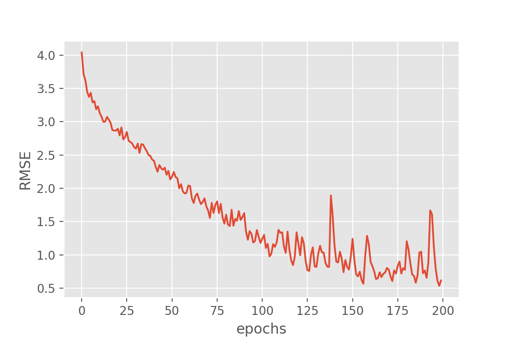
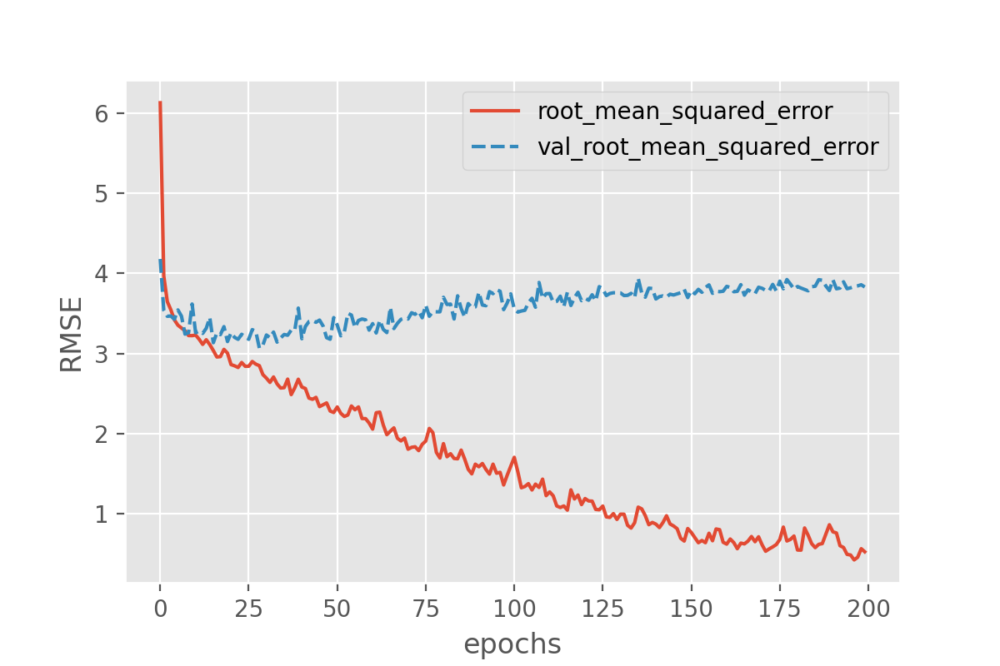
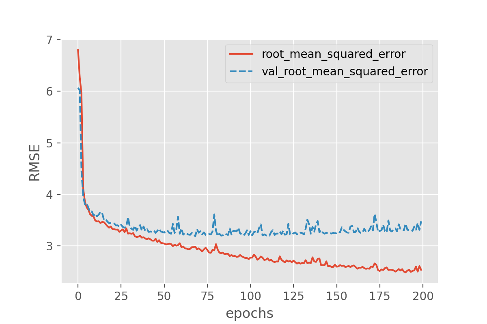
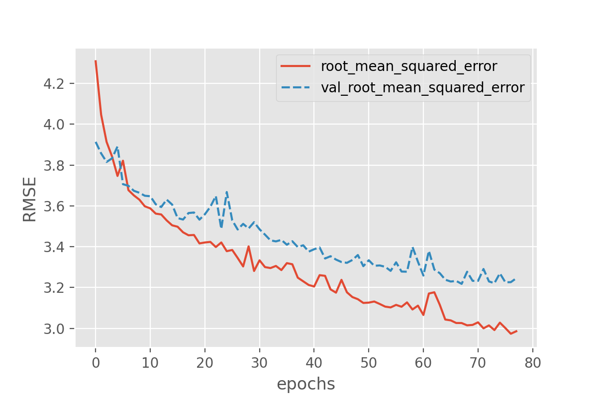
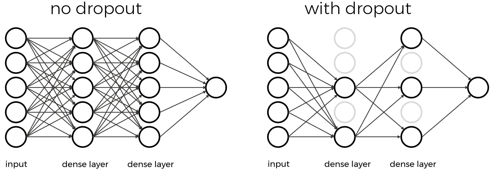
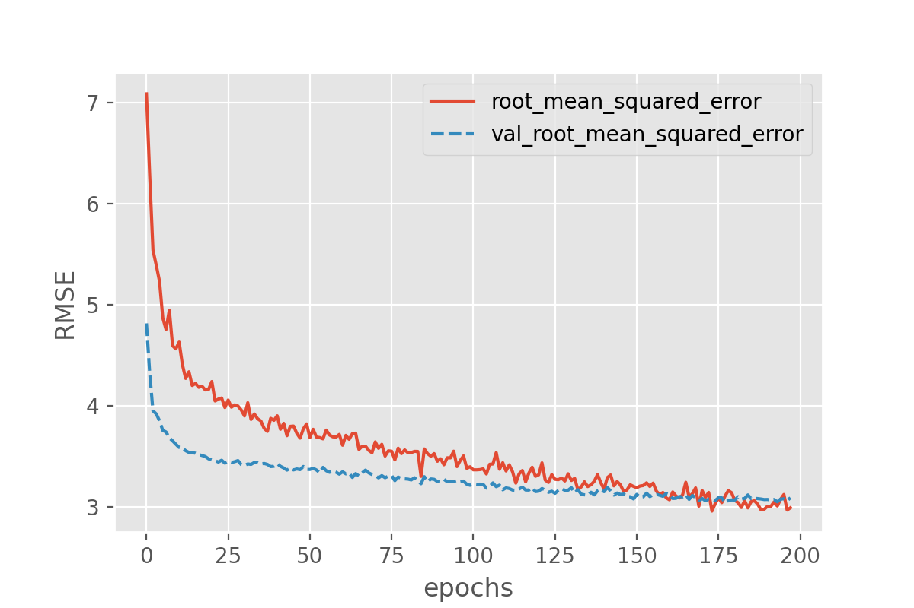
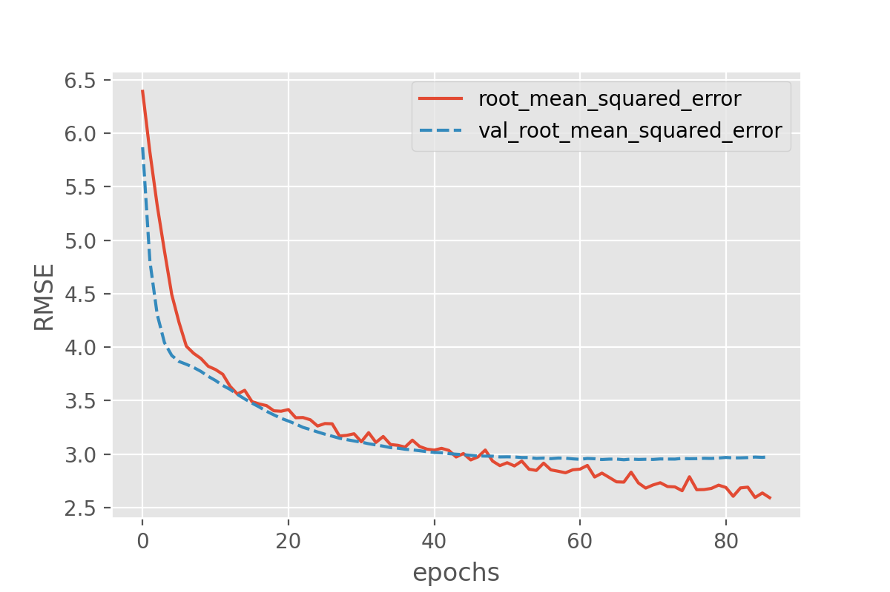
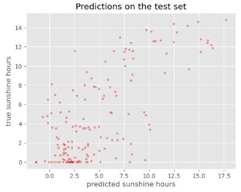
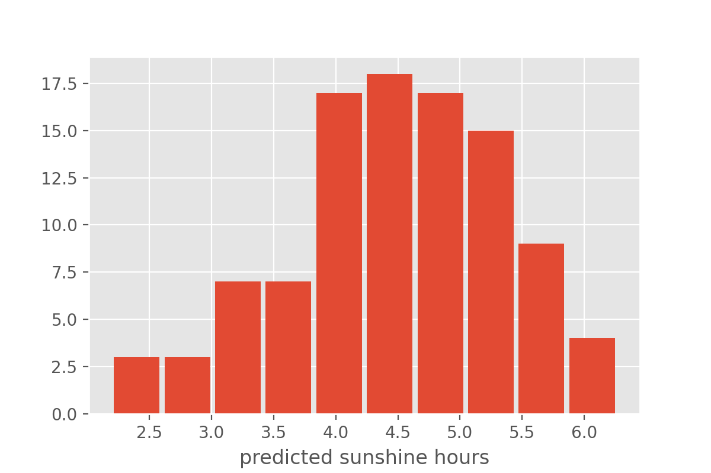

## Import dataset
Here we want to work with the *weather prediction dataset* which can be downloaded from [ADD ZENODO LINK].
It contains daily weather observations from 18 different European cities or places through the years 2000 to 2010. For all locations the data contains the variables ‘mean temperature’, ‘max temperature’, and ‘min temperature’. In addition, for multiple of the following variables are provided: 'cloud_cover', 'wind_speed', 'wind_gust', 'humidity', 'pressure', 'global_radiation', 'precipitation', 'sunshine', but not all of them are provided for all locations. A more extensive description of the dataset including the different physical units is given in accompanying metadata file.

~~~
filename_data = os.path.join(path_data, "weather_prediction_dataset.csv")
data = pd.read_csv(filename_data)
data.head()
~~~
{:.language-python}

| | DATE 	| MONTH | 	BASEL_cloud_cover 	| 	BASEL_humidity 	| 	BASEL_pressure	| ... |
|------:|------:|---------------:|--------------:|------------------:|------------:|------------:|
|0| 	20000101 	|1 	|8 	|0.89 	|1.0286|... |
|1| 	20000102 	|1 	|8 	|0.87 	|1.0318|... |
|2| 	20000103 	|1 	|5 	|0.81 	|1.0314|... |
|3| 	20000104 	|1 	|7 	|0.79 	|1.0262|... |
|4| 	20000105 	|1 	|5 	|0.90 	|1.0246|... |
{: .output}

### Select a subset and split into data (X) and labels (y)
The full dataset comprises 10 years (3654 days) from which we here will only select the first 3 years.
We will then define what exactly we want to predict from this data. Possible options could be to create an *interpolation* task by removing one location and predicing its values based on the remaining 17 locations. An even more frequent task when it comes to weather data, however, is to make a predicion about the weather somewhere in the future, say the next day. The present dataset is sorted by "DATE", so we can simply pick a feature and location that we want to predict with our model.
Here we will pick a rather difficult-to-predict feature, sunshine hours, which we want to predict for the location: BASEL.

~~~
# data
X_data = data.loc[:365*3].drop(columns=['DATE', 'MONTH'])

# labels (sunshine hours the next day)
y_data = data.loc[1:(365*3 + 1)]["BASEL_sunshine"]
~~~
{:.language-python}

### Split data and labels into training, validation, and test set
As with classical machine learning techniques, it is common in deep learning to split off a *test set* which remains untouched during model training and tuning. It is then later be used to evaluate the model performance. Here, we will also split off an additional *validation set*, the reason of which will hopefully become clearer later in this lesson.

## Regression and classification - how to set a training goal
- Explain how to define the output part of a neural network
- What is the loss function (and which one to chose for a regression or classification task)?

In episode 2 we trained a dense neural network on a *classification task*. For this one hot encoding was used together with a Categorical Crossentropy loss function.
This measured how close the distribution of the neural network outputs corresponds to the distribution of the three values in the one hot encoding.
Now we want to work on a *regression task*, thus not prediciting the right class for a datapoint but a certain value (could in principle also be several values). In our example we want to predict the sunshine hours in Basel (or any other place in the dataset) for tomorrow based on the weather data of all 18 locations today. 

### Network output layer:
The network should hence output a single float value which is why the last layer of our network will only consist of a single node. 

> ## Create the neural network
>
> We have seen how to build a dense neural network in episode 2. 
> Try now to construct a dense neural network with 3 layers for a regression task.
> You could for instance start with a network of a dense layer with 100 nodes, followed by one with 50 nodes and finally an output layer.
>
> * What must here be the dimension of our input layer?
> * How would our output layer look like? What about the activation function?
>
> > ## Solution
> > ~~~
> > def create_nn(n_features, n_predictions):
> >     # Input layer
> >     input = Input(shape=(n_features,), name='input')
> > 
> >     # Dense layers
> >     layers_dense = Dense(100, 'relu')(input)
> >     layers_dense = Dense(50, 'relu')(layers_dense)
> > 
> >     # Output layer
> >     output = Dense(n_predictions)(layers_dense)
> > 
> >     return Model(inputs=input, outputs=output, name="weather_prediction_model")
> > 
> > model = create_nn(n_features=X_data.shape[1], n_predictions=1)
> > model.summary()
> > ~~~
> > {:.language-python}
> >
> > ~~~
> > Model: "weather_prediction_model"
> > _________________________________________________________________
> > Layer (type)                 Output Shape              Param #   
> > =================================================================
> > input (InputLayer)           [(None, 163)]             0         
> > _________________________________________________________________
> > dense_0 (Dense)              (None, 100)               16400     
> > _________________________________________________________________
> > dense_1 (Dense)              (None, 50)                5050      
> > _________________________________________________________________
> > dense_2 (Dense)              (None, 1)                 51        
> > =================================================================
> > Total params: 21,501
> > Trainable params: 21,501
> > Non-trainable params: 0
> > _________________________________________________________________
> > ~~~
> > {:.output}
> >
> > The shape of the input layer has to correspond to the number of features in our data: 163
> > 
> > The output layer here is a dense layer with only 1 node. And we here have chosen to use *no activation function*.
> > While we might use *softmax* for a classification task, here we do not want to restrict the possible outcomes for a start.
> > 
> > In addition, we have here chosen to write the network creation as a function so that we can use it later again to initiate new models.
> {:.solution}
{:.challenge}

When compiling the model we can define a few very important aspects.

### Loss function:
The loss is what the neural network will be optimized on during training, so chosing a suitable loss function is crucial for training neural networks.
In the given case we want to stimulate that the prodicted values are as close as possible to the true values. This is commonly done by using the *mean squared error* (mse) or the *mean absolute error* (mae), both of which should work OK in this case. Often, mse is prefered over mae because it "punishes" large prediction errors more severely.
In keras this is implemented in the `keras.losses.MeanSquaredError` class.

### Optimizer:
Somewhat coupled to the loss function is the *optimizer* that we want to use. 
The *optimizer* here refers to the algorithm with which the model learns to optimize on the set loss function. A basic example for such an optimizer would be *stochastic gradient descent*. For now, we can largely skip this step and simply pick one of the most common optimizers that works well for most tasks: the *Adam optimizer*. 

### Metrics:
In our first example (episode 2) we plotted the progression of the loss during training. 
That is indeed a good first indicator if things are working alright, i.e. if the loss is indeed decreasing as it should. 
However, when models become more complicated then also the loss functions often become less intuitive (side remark: e.g. when adding L1 or L2 regularization). 
That is why it is good practice to monitor the training process with additional, more intuitive metrics. 
They are not used to optimize the model, but are simply recorded during training. 
With Keras they can simply be added via `metrics=[...]` and can contain one or multiple metrics of interest. 
Here we could for instance chose to use `'mae'` the mean absolute error, or the the *root mean squared error* (RMSE) which unlike the *mse* has the same units as the predicted values. Finally, after compiling we train the model on our training data for 200 epochs.

~~~
model.compile(optimizer='adam',
              loss='mse',
              metrics=[tf.keras.metrics.RootMeanSquaredError()])
~~~
{: .language-python}

## Train a dense neural network
Now that we created and compiled our dense neural network, we can start training it.
~~~
history = model.fit(X_train, y_train,
                    batch_size=10,
                    epochs=200,
                    verbose=2)
~~~
{: .language-python}

We can plot the training process using the history:
~~~
history_df = pd.DataFrame.from_dict(history.history)
sns.lineplot(data=history_df['root_mean_squared_error'])
plt.xlabel("epochs")
plt.ylabel("RMSE")
~~~
{: .language-python}

This looks very promising! Our loss ("mse") is dropping nicely and while it maybe keeps fluctuating a bit it does end up at fairly low *mse* values.
But the *mse* is just the *mean* squared error, so we might want to look a bit more in detail how well our just trained model does in predicting the sunshine hours.

## Evaluate our model
There is not a single way to evaluate how a model performs. But there is at least two very common approaches. For a *classification task* that is to compute a *confusion matrix* for the test set which shows how often particular classes were predicted correctly or incorrectly. For the present *regression task* however, it makes more sense to compare true and predicted values in simple scatter plot.

First, we will do the actual prediction step. 
> ## Predict the labels for both training and test set and compare to the true values
> Even though we here use a different model architecture and a different task compared to episode 2, the prediction step is mostly identical.
> Here you should predict the labels for the training set and the test set and then compare them in a scatter plot to the true labels.
> 
> * Is the accuracy of the predictions as you expected (or better/worse)? 
> * Is there a noteable difference between training set and test set? And if so, any idea why?
> > ~~~
> > y_train_predicted = model.predict(X_train)
> > y_test_predicted = model.predict(X_test)
> > ~~~
> > {: .language-python}
> > We can then compare those to the true labels, for instance by
> > ~~~
> > fig, axes = plt.subplots(1, 2, figsize=(12, 6))
> > plt.style.use('ggplot')  # optional, that's only to define a visual style
> > axes[0].scatter(y_train_predicted, y_train, s=10, alpha=0.5, color="teal")
> > axes[0].set_title("training set")
> > axes[0].set_xlabel("predicted sunshine hours")
> > axes[0].set_ylabel("true sunshine hours")
> > 
> > axes[1].scatter(y_test_predicted, y_test, s=10, alpha=0.5, color="teal")
> > axes[1].set_title("test set")
> > axes[1].set_xlabel("predicted sunshine hours")
> > axes[1].set_ylabel("true sunshine hours")
> > ~~~
> > {: .language-python}
> > 
> > Maybe that is not exactly what you expected? What is the issue here? Any ideas?
> > 
> > The accuracy on the training set is fairly good. 
> > In fact, considering that the task of predicting the daily sunshine hours is really not easy it might even be surprising how well the model predicts that 
> > (at least on the training set). Maybe a little too good?
> > For those familiar with (classical) machine learning this might look familiar. 
> > It is a very clear signature of *overfitting* which means that the model has to some extend memorized aspects of the training data. 
> > As a result makes much more accurate predictions on the training data than on unseen data.
> {:.solution}
{:.challenge}

Overfitting also happens in classical machine learning, but there it is usually interpreted as the model having more parameters than the training data would justify (say, a decision tree with too many branches for the number of training instances). As a consequence one would reduce the number of parameters to avoid overfitting.
In deep learning the situation is slightly different. It can -same as for classical machine learning- also be a sign of having a *too big* model, meaning a model with too many parameters (layers and/or nodes). However, in deep learning higher number of model parameters are often still considered acceptable and models often perform best (in terms of prediction accuracy) when they are at the verge of overfitting. So, in a way, training deep learning models is always a bit like playing with fire...

## Watch your model training closely
As we just saw, deep learning models are prone to overfitting. Instead of iterating through countless cycles of model trainings and subsequent evaluations with a reserved test set, it is common practice to work with a 2nd split off dataset to monitor the model during training. This is the *validation set* which can be regarded as a 2nd test set. As with the test set the datapoints of the *validation set* are not used for the actual model training itself. Instead we evalute the model with the *validation set* after every epoch during training, for instance to splot if we see signs of clear overfitting.

Let's give this a try!

We need to initiate a new model -- otherwise Keras will simply assume that we want to continue training the model we already trained above.
~~~
model = create_nn(n_features=X_data.shape[1], n_predictions=1)
model.compile(optimizer='adam',
              loss='mse',
              metrics=[tf.keras.metrics.RootMeanSquaredError()])
~~~
{: .language-python}

But now we train it with the small addition of also passing it our validation set:
~~~
history = model.fit(X_train, y_train,
                    batch_size=10,
                    epochs=200,
                    validation_data=(X_val, y_val),
                    verbose=2)
~~~
{: .language-python}

As before the history allows plotting the training progress.
~~~
history_df = pd.DataFrame.from_dict(history.history)
sns.lineplot(data=history_df[['root_mean_squared_error', 'val_root_mean_squared_error']])
plt.xlabel("epochs")
plt.ylabel("RMSE")
~~~
{: .language-python}

This clearly shows that something is not completely right here. 
The model predictions on the validation set quickly seem to reach a plateau while the performance on the training set keeps improving.
That is a clear signature of overfitting.

## Counteract model overfitting
Overfitting is a very common issue and there are many strategies to handle it.
Most similar to classical machine learning might to **reduce the number of parameters**.

> ## Try to reduce the degree of overfitting by lowering the number of parameters
>
> We can keep the network architecture unchanged (2 dense layers + a one-node output layer) and only play with the number of nodes per layer.
> Try to lower the number of nodes in one or both of the two dense layers and observe the changes to the training and validation losses.
>
> * Is it possible to get rid of overfitting this way?
> * Does the overall performance suffer or does it mostly stay the same?
> * How low can you go with the number of paramters without notable effect on the performance on the validation set?
>
> > ## Solution
> > ~~~
> > def create_nn(n_features, n_predictions, nodes1, nodes2):
> >     # Input layer
> >     input = Input(shape=(n_features,), name='input')
> > 
> >     # Dense layers
> >     layers_dense = Dense(nodes1, 'relu')(input)
> >     layers_dense = Dense(nodes2, 'relu')(layers_dense)
> > 
> >     # Output layer
> >     output = Dense(n_predictions)(layers_dense)
> > 
> >     return Model(inputs=input, outputs=output, name="model_small")
> > 
> > model = create_nn(X_data.shape[1], 1, 10, 5)
> > model.summary()
> > ~~~
> > {:.language-python}
> >
> > ~~~
> > Model: "model_small"
> > _________________________________________________________________
> > Layer (type)                 Output Shape              Param #   
> > =================================================================
> > input (InputLayer)           [(None, 163)]             0         
> > _________________________________________________________________
> > dense_21 (Dense)             (None, 10)                1640      
> > _________________________________________________________________
> > dense_22 (Dense)             (None, 5)                 55        
> > _________________________________________________________________
> > dense_23 (Dense)             (None, 1)                 6         
> > =================================================================
> > Total params: 1,701
> > Trainable params: 1,701
> > Non-trainable params: 0
> > _________________________________________________________________
> > ~~~
> > {:.output}
> >
> > ~~~
> > history = model.fit(X_train, y_train,
> >                     batch_size = 50,
> >                     epochs = 200,
> >                     validation_data=(X_val, y_val), verbose = 2)
> >                     
> > history_df = pd.DataFrame.from_dict(history.history)
> > sns.lineplot(data=history_df[['root_mean_squared_error', 'val_root_mean_squared_error']])
> > plt.xlabel("epochs")
> > plt.ylabel("RMSE")
> > ~~~
> > {:.language-python}
> > 
> > 
> > 
> > There is obviously no single correct solution here. But you will have noticed that the number of nodes can be reduced quiet a bit!
> > 
> > In general, it quickly becomes a very complicated search for the right "sweet spot", i.e. the settings for which overfitting will be (nearly) avoided but which still performes equally well.
> > 
> {:.solution}
{:.challenge}

We saw that reducing the number of parameters can be a strategy to avoid overfitting.
In practice, however, this is usually not the (main) way to go when it comes to deep learning.
One reason is, that finding the sweet spot can be really hard and time consuming. And it has to be repeated every time the model is adapted, e.g. when more training data becomes available.

## Early stopping: stop when things are looking best
Arguable **the** most common technique to avoid (severe) overfitting in deep learning is called **early stopping**.
As the name suggests, this technique just means that you stop the model training if things do not seem to improve anymore.
More specifically, this usually means that the training is stopped if the validation loss does not (notably) improve anymore.
Early stopping is both intuitive and effective to use, so it has become a standard addition for model training.

To better study the effect, we can now savely go back to models with many (too many?) parameters:
~~~
model = create_nn(X_data.shape[1], 1, 100, 50)
model.compile(optimizer='adam',
              loss='mse',
              metrics=[tf.keras.metrics.RootMeanSquaredError()])
~~~
{: .language-python}

To apply early stopping during training it is easiest to use keras `EarlyStopping` class.
This allows to define the condition of when to stop training. In our case we will say when the validation loss is lowest.
However, since we have seen quiet some fluctuation of the losses during training above we will also set `patience=10` which means that the model will stop training of the validation loss has not gone down for 10 epochs.
~~~
from tensorflow.keras.callbacks import EarlyStopping

earlystopper = EarlyStopping(
    monitor='val_loss', mode="min",
    patience=10,
    verbose=1
    )

history = model.fit(X_train, y_train,
                    batch_size = 50,
                    epochs = 200,
                    validation_data=(X_val, y_val),
                    callbacks=[earlystopper],
                    verbose = 2)
~~~
{: .language-python}

As before, we can plot the losses during training:
~~~
history_df = pd.DataFrame.from_dict(history.history)
sns.lineplot(data=history_df[['root_mean_squared_error', 'val_root_mean_squared_error']])
plt.xlabel("epochs")
plt.ylabel("RMSE")
~~~
{: .language-python}

This still seems to reveal the onset of overfitting, but the training stops before the discrepancy between training and validation loss can grow further.
Despite avoiding severe cases of overfitting, early stopping has the additional advantage that the number of training epochs will be regulated automatically.
Instead of comparing training runs for different number of epochs, early stopping allows to simply set the number of epochs to a desired maximum value.

What might be a bit unintuitive is that the training runs might now end very rapidly (in particular when the learning rate is high).
This might spark the question: have we really reached an optimum yet?
And often the answer this this is "no", which is my frequently other approaches to hinder overfitting from happening are combined with early stopping.

## Dropout: make it harder to memorize things
Overfitting means that a model (seemingly) performs better on seen data compared to unseen data. One then often also says that it does not "generalize" well.
Techniques to avoid overfitting, or to improve model generalization, are termed **regularization techniques**. 
One of the most versatile regularization technique is **dropout**.
Dropout essentially means that during each training cycle a random fraction of the dense layer nodes are turned off. This is described with the dropout rate between 0 and 1 which determines the fraction of nodes to silence at a time. 

The intuition behind dropout is that it enforces redundancies in the network by constantly removing different elements of a network. The model can no longer rely on individual nodes and instead must create multiple "paths". In addition, the model has to make predictions with much fewer nodes and weights (connections between the nodes). 
As a result, it becomes much harder for a network to memorize particular features. At first this might appear a quiet drastic approach which affects the network architecture strongly.
In practice, however, dropout is computationally a very elegant solution which does not affet training speed. And it frequently works very well.

**Important to note:** Dropout layers will only randomly silence nodes during training! During a predictions step, all nodes remain active (dropout is off).

Let's add dropout to our neural network which we will do by using keras `Dropout` layer (documentation & reference: https://keras.io/api/layers/regularization_layers/dropout/).
One additional change that we will make here is to lower the learning rate because in the last training example the losses seemed to fluctuate a lot.
~~~
from tensorflow.keras.layers import Dropout

def create_nn(n_features, n_predictions):
    # Input layer
    layers_input = Input(shape=(n_features,), name='input')

    # Dense layers
    layers_dense = Dense(100, 'relu')(layers_input)
    layers_dense = Dropout(rate=0.2)(layers_dense)
    layers_dense = Dense(50, 'relu')(layers_dense)
    layers_dense = Dropout(rate=0.2)(layers_dense)

    # Output layer
    layers_output = Dense(n_predictions)(layers_dense)

    # Defining the model and compiling it
    return Model(inputs=layers_input, outputs=layers_output, name="model_dropout")

model = create_nn(X_data.shape[1], 1)
model.compile(loss='mse', optimizer=Adam(1e-4), metrics=[tf.keras.metrics.RootMeanSquaredError()])
model.summary()
~~~
{: .language-python}

Model: "model_dropout"
_________________________________________________________________
Layer (type)                 Output Shape              Param #   
=================================================================
input (InputLayer)           [(None, 163)]             0         
_________________________________________________________________
dense_12 (Dense)             (None, 100)               16400     
_________________________________________________________________
dropout (Dropout)            (None, 100)               0         
_________________________________________________________________
dense_13 (Dense)             (None, 50)                5050      
_________________________________________________________________
dropout_1 (Dropout)          (None, 50)                0         
_________________________________________________________________
dense_14 (Dense)             (None, 1)                 51        
=================================================================
Total params: 21,501
Trainable params: 21,501
Non-trainable params: 0
_________________________________________________________________
{: .output}

Compared to the models above, this required little changes. We add two `Dropout` layers, one after each dense layer and specify the dropout rate.
Here we use `rate=0.2` which means that at any training step 20% of all nodes will be turned off.
You can also see that Dropout layers do not add additional parameters.
Now, let's train our new model and plot the losses:

~~~
history = model.fit(X_train, y_train,
                    batch_size = 50,
                    epochs = 1000,
                    validation_data=(X_val, y_val),
                    callbacks=[earlystopper],
                    verbose = 2)

history_df = pd.DataFrame.from_dict(history.history)
sns.lineplot(data=history_df[['root_mean_squared_error', 'val_root_mean_squared_error']])
plt.xlabel("epochs")
plt.ylabel("RMSE")
~~~
{: .language-python}                  

In this setting overfitting seems to be pervented succesfully. The overall results though have not improved (at least not by much).

## BatchNorm: the "standard scaler" for deep learning
A very common step in classical machine learning pipelines is to scale the features, for instance by using sckit-learn's `StandardScaler`.
This can in principle also be done for deep learning.
An alternative, more common approach, is to add **BatchNormalization** layers which will learn how to scale the input values.
Similar to dropout, batch normalization is available as a network layer in keras and can be added to the network in a similar way.
It does not require any additional parameter setting. 

~~~
from tensorflow.keras.layers import BatchNormalization
~~~
{: .language-python} 

## Exercise: Add a BatchNormalization layer as the first layer to your neural network.
(documentation & reference: https://keras.io/api/layers/normalization_layers/batch_normalization/)

~~~
def create_nn(n_features, n_predictions):
    # Input layer
    layers_input = Input(shape=(n_features,), name='input')

    # Dense layers
    layers_dense = BatchNormalization()(layers_input)
    layers_dense = Dense(100, 'relu')(layers_dense)
    layers_dense = Dropout(rate=0.2)(layers_dense)
    layers_dense = Dense(50, 'relu')(layers_dense)
    layers_dense = Dropout(rate=0.2)(layers_dense)

    # Output layer
    layers_output = Dense(n_predictions)(layers_dense)

    # Defining the model and compiling it
    return Model(inputs=layers_input, outputs=layers_output, name="model_dropout_batchnorm")

model = create_nn(X_data.shape[1], 1)
model.compile(loss='mse', optimizer=Adam(1e-4), metrics=[tf.keras.metrics.RootMeanSquaredError()])
model.summary()
~~~
{: .language-python}      

Which is then trained as above:
~~~
history = model.fit(X_train, y_train,
                    batch_size = 50,
                    epochs = 1000,
                    validation_data=(X_val, y_val),
                    callbacks=[earlystopper],
                    verbose = 2)

history_df = pd.DataFrame.from_dict(history.history)
sns.lineplot(data=history_df[['root_mean_squared_error', 'val_root_mean_squared_error']])
plt.xlabel("epochs")
plt.ylabel("RMSE")
~~~
{: .language-python}      

## Run on test set and compare to naive baseline
It seems that no matter what we add, the overall loss does not decrease much further (we at least avoided overfitting though!).
Let's again plot the results on the test set:
~~~
y_test_predicted = model.predict(X_test)

plt.figure(figsize=(5, 5), dpi=100)
plt.scatter(y_test_predicted, y_test, s=10, alpha=0.5)
plt.xlabel("predicted sunshine hours")
plt.ylabel("true sunshine hours")
~~~
{: .language-python} 

Well... certainly not perfect. But how good or bad is this? Maybe not good enough to plan your picnic for tomorrow.
But let's better compare it to a naive baseline.
Maybe the simplest prediction to make would be to say: Tomorrow we will have the same number of sunshine hours as today. Let's compare to this.

~~~
plt.figure(figsize=(5, 5), dpi=100)
plt.scatter(X_test["BASEL_sunshine"], y_test, s=10, alpha=0.5)
plt.xlabel("sunshine hours yesterday")
plt.ylabel("true sunshine hours")
~~~
{: .language-python} 

## Optional part - prediction uncertainty using Monte-Carlo Dropout
Depending on the data and the question asked, model predictions can be highly accuracte. Or, as in the present case, show a high degree of error.
In both cases, however, it often is highly relevant to not get model predictions but also an estimate of how reliable those predictions are.
The last years, this has been a very dynamic, rapidly growing area and there are many different ways to do uncertainty evaluation in deep learning.
Here we want to present a very versatile and easy-to-implement method: **Monte-Carlo Dropout** (original reference: https://arxiv.org/abs/1506.02142).

Above we have used dropout to randomly turn off network nodes during training.
When doing predictions, dropout is automatically deactivated and all nodes stay active.
Each time you run the same input data through the same trained model, the prediciton will be exactly the same.

Monte-Carlo Dropout relies on a simply change: dropout will remain active during prediction!
This means that each time a prediction step is done, the model will look differently because a fraction of all nodes will be turned off randomly.
One can interpret all of those random variations as individual models. 
Monte-Carlo Dropout now makes use of this fact and collects many different predictions instead of only one.
At the end this collection of predictions can be combined to a mean (or a median) prediction. 
And the variation of all predictions can tell something about the model's uncertainty.

A simple (and a bit hacky) way to enforce dropout layers to remain active is to add `training=True` to the model:
~~~
def create_nn(n_features, n_predictions):
    # Input layer
    layers_input = Input(shape=(n_features,), name='input')

    # Dense layers
    layers_dense = BatchNormalization()(layers_input)
    layers_dense = Dense(100, 'relu')(layers_dense)
    layers_dense = Dropout(rate=0.2)(layers_dense, training=True)
    layers_dense = Dense(50, 'relu')(layers_dense)
    layers_dense = Dropout(rate=0.2)(layers_dense, training=True)

    # Output layer
    layers_output = Dense(n_predictions)(layers_dense)

    # Defining the model and compiling it
    return Model(inputs=layers_input, outputs=layers_output, name="model_monte_carlo_dropout")

model = create_nn(X_data.shape[1], 1)
model.compile(loss='mse', optimizer=Adam(1e-4), metrics=[tf.keras.metrics.RootMeanSquaredError()])
~~~
{: .language-python} 

Model training remains entirely unchanged:
~~~
history = model.fit(X_train, y_train,
                    batch_size = 50,
                    epochs = 1000,
                    validation_data=(X_val, y_val),
                    callbacks=[earlystopper],
                    verbose = 2)
~~~
{: .language-python} 

But when now doing predictions, things will look different.
Let us do two predictions an compare the results.

~~~
y_test_predicted1 = model.predict(X_test)
y_test_predicted2 = model.predict(X_test)

y_test_predicted1[:10], y_test_predicted2[:10]
~~~
{: .language-python} 

This should give two arrays with different float numbers.

We can now compute predictions for a larger ensemble, say 100 random variations of the same model:
~~~
from tqdm.notebook import tqdm  # optional: to add progress bar

n_ensemble = 100
y_test_predicted_ensemble = np.zeros((X_test.shape[0], n_ensemble))

for i in tqdm(range(n_ensemble)):  # or: for i in range(n_ensemble):
    y_test_predicted_ensemble[:, i] = model.predict(X_test)[:,0]
~~~
{: .language-python} 

This will give an array of predictions, 100 different predictions for each datapoint in `X_test`.
We can inspect an example distribution, for instance by plotting a histrogram:

~~~
plt.hist(y_test_predicted_ensemble[0,:], rwidth=0.9)
plt.xlabel("predicted sunshine hours")
~~~
{: .language-python} 

Instead of full distributions for every datapoint we might also just want to extract the mean and standard deviation.
~~~
y_test_predicted_mean = np.mean(y_test_predicted_ensemble, axis=1)
y_test_predicted_std = np.std(y_test_predicted_ensemble, axis=1)
~~~
{: .language-python} 

This can then be plotted again as a scatter plot, but now with added information on the model uncertainty.
~~~
plt.figure(figsize=(5, 5), dpi=100)
plt.scatter(y_test_predicted_mean, y_test, s=40*y_test_predicted_std, 
            c=y_test_predicted_std, alpha=0.5)
plt.xlabel("predicted")
plt.ylabel("true values")
~~~
{: .language-python} 

